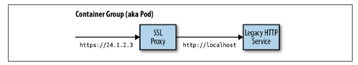
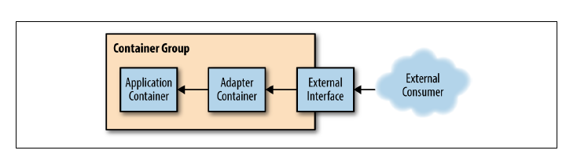
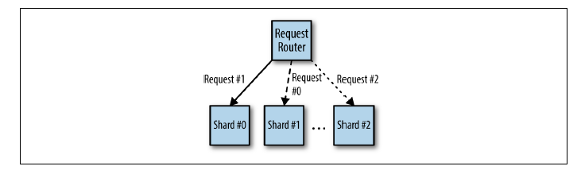
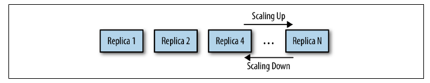
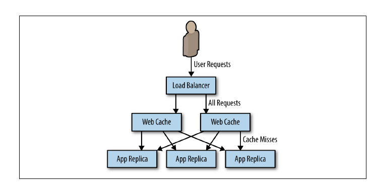
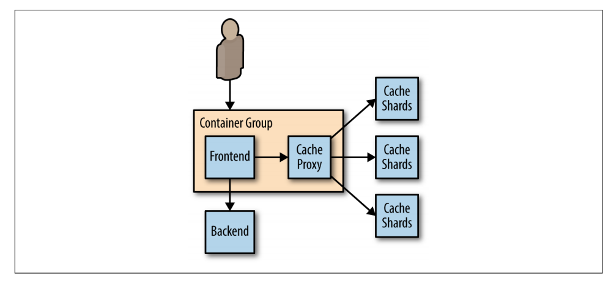
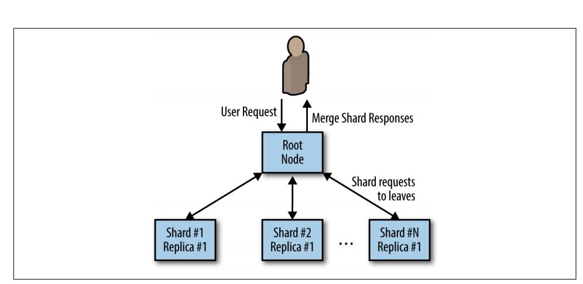
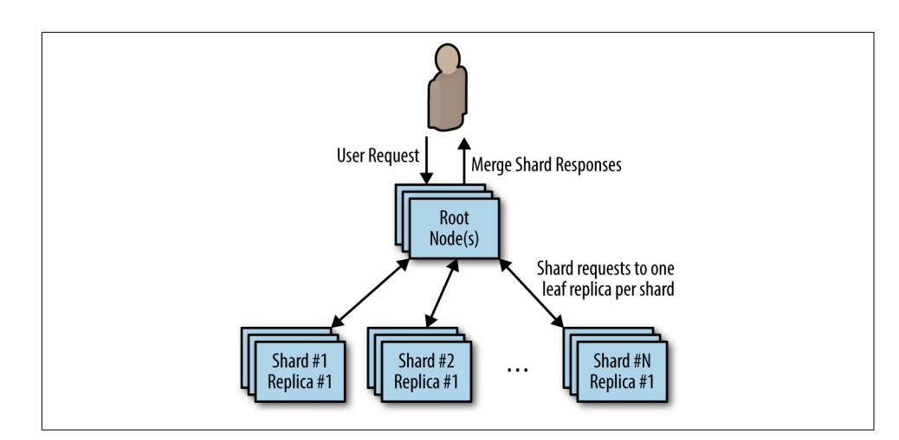
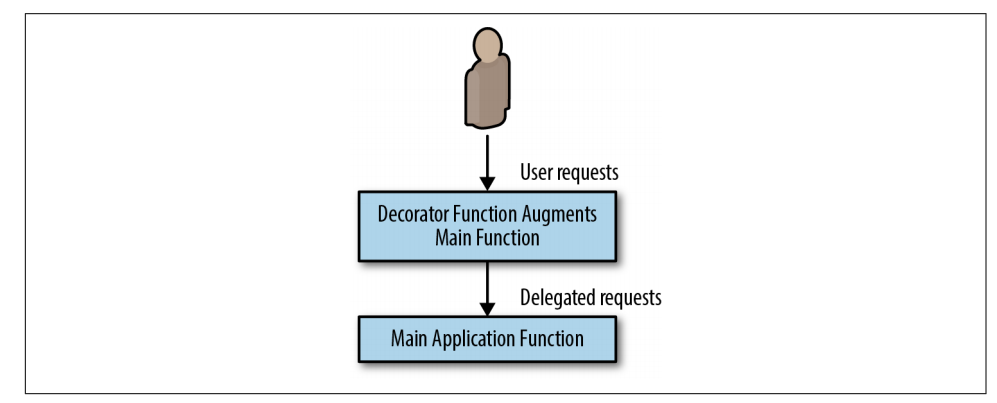

Cloud Computing Patterns
---

### Sidecar Pattern

### Adapter Pattern

### Sharded Service Pattern

### Replicated Service Pattern

### Caching Layer Pattern

### Sharded Replicated Cache Pattern

### Scatter/Gather Pattern

### Sharded Replicated Scatter/Gather Pattern

### Decorator Pattern

